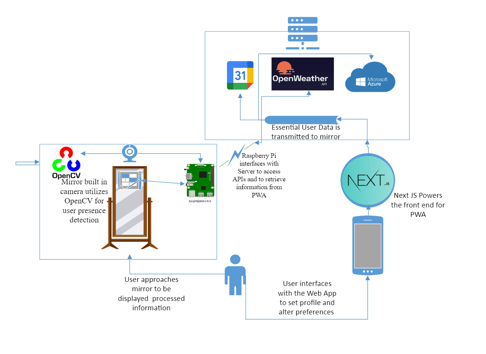

# System Block Diagram

***Figure 1.*** High-level design of SmartMirror

Figure 1 represents the high level design of the smart mirror ecosystem. The smart mirror ecosystem consists of a physical mirror equipped with a RaspberryPi and sensors, and also consists of a mobile device that utilizes a progressive web app for the front end. The user could also interact with the frontend using a desktop/laptop computer. The front end will utilize the Next.Js framework. Several cloud services such as OpenWeather and Microsoft Azure will be used to facilitate the SmartMirror's infotainnment. The user will approach a mirror and be displayed information based on data streamed from the app and numerous APIs. The user can adjust preferences and profiles by interfacing with the app.

