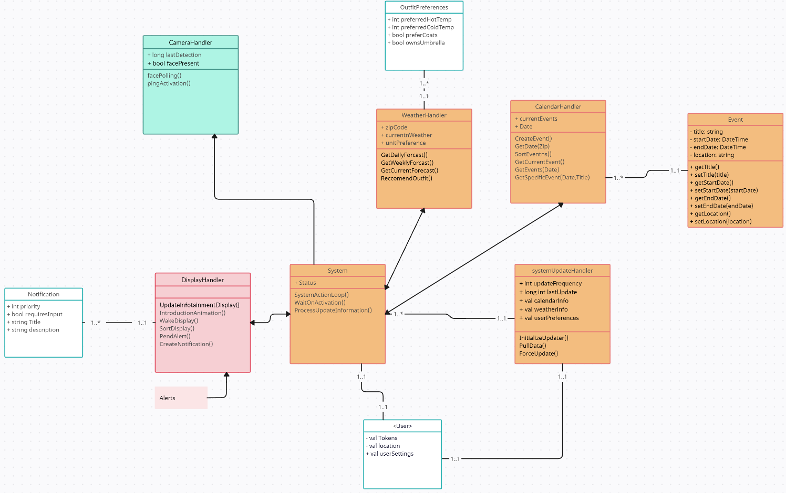
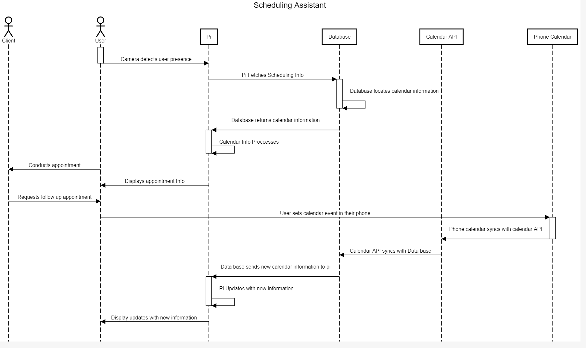
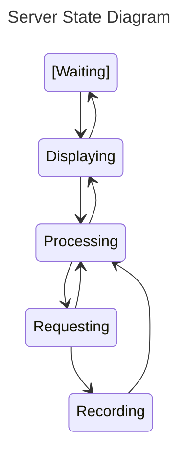
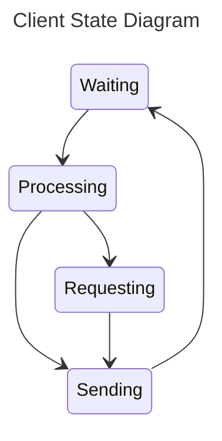
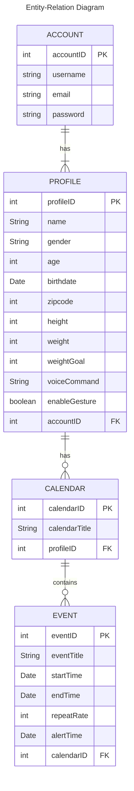

# Design
**Purpose**

The Design Document - Part I Architecture describes the software architecture and how the requirements are mapped into the design. This document will be a combination of diagrams and text that describes what the diagrams are showing.

## Compenents

### Mirror Backend

***Figure 1 - Raspberry Pi Backend***

Figure 1 shows a class diagram of the backend system that is on the mirror. 
- The backend system is hosted on a Raspberry Pi.
- The User interfaces directly with the Mirror
- The mirror system will consistently poll for updates, and update the respective onboard systems based on the information

## Sequence Diagrams

**Use Case #1 Custom Widgets**: The user wants to view a custom widget on their current mirror layout so that they can view current stock quotes when they look at the mirror in the morning.

Custom Widgets Description

  
The user:
1. Opens the companion app.
2. Navigates to the Widget section of the app.
3. Presses the Add New Widget button. 
4. Selects a stock-related widget from the list of widgets available.
5. Chooses which sub-profile and where on the mirror the widget shall be added.
6. Saves their progress.
7. Walks up to the mirror to turn the mirror on.
8. Observes the mirror reflecting the user's changes.

**Use Case #3 Sub-profiles**: A user wants to create a sub-profile for someone else who also uses the mirror at 5pm on Sundays.

Sub-profiles Description

1. Opens the companion app.
2. Navigates to the Sub-Profile section of the app.
3. Clicks on the Create Sub-Profile button.
4. Clicks on the title field and gives the Sub-Profile a name.
5. Adds and customizes the elements on the mirror layout of the new Sub-Profile.
6. Inputs Sunday and 5pm into the Scheduled Switching field.
7. Saves their progress.
8. Is able to view their sub-profile on the mirror at 5pm on Sundays.

**Use Case #4 Height/Weight Tracking**: A user wants to set a weight goal from scratch and track their height and weight so they will have an easy way to access the knowledge needed to work towards their ideal weight.

Height/Weight Tracking Description

1. Opens the companion app.
2. Navigates to the Health section of the app.
3. Presses the Add Weight Goal button.
4. Inputs their desired weight.
5. Inputs their height and weight.
6. Saves their progress.
7. May update their height and weight when they wish.
9. Adds the built-in health widget to their sub-profile.
8. Is able to view their weight goal and weight history.
  
  

**Use Case #5 Rainy Day**: A user that wants to be informed on what to wear throughout the day as they are rushing to get ready to leave the house for work.

Rainy Day Description

1. They step in front of the mirror as they do their daily morning routine in the bathroom.
2. The camera detects the user’s face with the camera and turns on the screen display behind the 2 way mirror.
3. The mirror's Rasberry Pi retrieves data from the Open Weather API.
3. The mirrors widget display shows a heavy rain forecast icon in the afternoon despite being currently clear as day.
4. The user remembers to grab their raincoat and umbrella and goes about their day avoiding the uncomfortableness of cold rain.

**Use Case #6 ToDo List**: A user that has a busy day full of important tasks to do wants to reference his Todo list on the cloud when they’re at home

ToDo List Description

1. The user opens up the smart mirror companion app and fills out his important task of checking in with his family member weekly after work.
2. The user goes about his normal routine, gets back home later on and views their mirror which reminds them of their task.
3. After being reminded, they call their family members and see how they are doing.
4. When the call is finished they open the companion app and check off their task for this week.

**Use Case #7  Scheduling Assistant**: A user that has a strict schedule of appointments with their clients wants to view their schedule at their workshop.

Scheduling Assistant Description

1. The user steps in front of their mirror at their workshop.
2. The camera detects the user’s face with the camera and turns on the screen display behind the 2 way mirror.
3. User glances at the calendar display widget on the screen and sees that their next appointment is in 20 minutes.
4. They get ready for their appointment with their client.
5. The client asks to have a followup appointment next month, the user decides to mark this in their companion app.
6. They open their google calendar app and denote the information for this event.
7. They will click submit and the event will appear on their smart mirror the day of the event.
8. On the day of the next event, the event shows on the display.

## Algorithm

A smart mirror employing face recognition to enable user access follows a straightforward process. Equipped with an embedded camera, the mirror captures live video of individuals in its vicinity. This video feed is then processed to detect faces, utilizing algorithms like Haar cascades or deep learning-based face detection models. Once a face is detected, a pre-trained face recognition model compares the facial features extracted from the detected face with those of authorized users stored in a database. If a match is found within an acceptable confidence level, the system authenticates the user and unlocks the smart mirror, granting access to personalized information such as calendar events, weather updates, or other tailored data. The mirror automatically locks when it no longer detects a recognized face, enhancing security and privacy. In cases where face recognition might not work optimally, a fallback mechanism such as a PIN code or traditional key could be provided for authentication, ensuring a reliable and secure user experience.

## State Diagrams

##### Server State Diagram
The diagram above shows the different states that Smart Mirror will operate in. First the mirror acts in the waiting state, while it idles and waits for a face to be recognized. Once a face is seen the program will start displaying and the user's default widgets will appear. When new data is to be requested, the state then moves to the processing stage where it will determine if the data is already captured in the database, if it is then it will move back to the displaying state. If the data is not in the database then the state will change to requesting, and then the required data will start to be requested. Once the new data is requested, it will be recorded in the database and then processed. Once the data is processed it will then be displayed. The mirror will move from the display state to the waiting state if a face is not recognized in a short period of time.

##### Client State Diagram
The diagram above shows the states for the client side companion application. Initially we begin in the waiting phase where we wait for user input. Once the user does an action in the application we move to the processing stage where we decide how to follow the user's commands. If we have the data already in our database we move to the sending to server state. Otherwise if we need to request data then we move to the requesting state. After requesting data, we then move to the recording state where we record the information in our database. Once the data is recorded we move to the sending state where we send the data the Rasberry Pi server. Then we move to the waiting state again for further instructions.

## Database

**Table Design**

The diagram above depicts the relationship between the entities to be stored in the database. All sensitive information will be encrypted.
ACCOUNT: Stores the account information of the user, which consists of their username, email and password.
PROFILE: Stores the information of the one or several sub-profiles associated with the account of the user. This information includes their name, gender, age, birth date, zip code, height, weight, a chosen weight goal, a list of voice commands, and a toggle to enable motion gesture functionality.
CALENDAR: Stores the information of the calendars of each sub-profile, if they have one. This includes the title of the calendar.
EVENT: Stores the information of each event of a calendar. This includes the event's title, the starting time, the ending time, the times at which the event should repeat itself, and the time to alert the user.

PK: Primary Key, FK: Foreign Key

A check list for architecture design is attached here [architecture\_design\_checklist.pdf](https://templeu.instructure.com/courses/106563/files/16928870/download?wrap=1 "architecture_design_checklist.pdf")  and should be used as a guidance.
