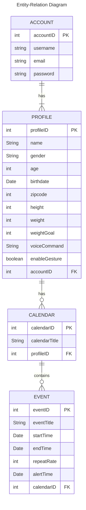

**Purpose**

The Design Document - Part I Architecture describes the software architecture and how the requirements are mapped into the design. This document will be a combination of diagrams and text that describes what the diagrams are showing.

**Sequence Diagrams**

**Use Case #1 Custom Widgets**: The user wants to view a custom widget on their current mirror layout so that they can view current stock quotes when they look at the mirror in the morning.

Custom Widgets Description

  
The user:
1. Opens the companion app.
2. Navigates to the Widget section of the app.
3. Presses the Add New Widget button. 
4. Selects a stock-related widget from the list of widgets available.
5. Chooses which sub-profile and where on the mirror the widget shall be added.
6. Saves their progress.
7. Walks up to the mirror to turn the mirror on.
8. Observes the mirror reflecting the user's changes.
    

**Use Case #5 Rainy Day**: A user that wants to be informed on what to wear throughout the day as they are rushing to get ready to leave the house for work.

Rainy Day Description

1. They step in front of the mirror as they do their daily morning routine in the bathroom.
2. The camera detects the user’s face with the camera and turns on the screen display behind the 2 way mirror.
3. The mirror's Rasberry Pi retrieves data from the Open Weather API.
3. The mirrors widget display shows a heavy rain forecast icon in the afternoon despite being currently clear as day.
4. The user remembers to grab their raincoat and umbrella and goes about their day avoiding the uncomfortableness of cold rain.

**Use Case #6 ToDo List**: A user that has a busy day full of important tasks to do wants to reference his Todo list on the cloud when they’re at home

ToDo List Description

1. The user opens up the smart mirror companion app and fills out his important task of checking in with his family member weekly after work.
2. The user goes about his normal routine, gets back home later on and views their mirror which reminds them of their task.
3. After being reminded, they call their family members and see how they are doing.
4. When the call is finished they open the companion app and check off their task for this week.

**Database**

**Table Design**

The diagram above depicts the relationship between the entities to be stored in the database. All sensitive information will be encrypted.
ACCOUNT: Stores the account information of the user, which consists of their username, email and password.
PROFILE: Stores the information of the one or several sub-profiles associated with the account of the user. This information includes their name, gender, age, birth date, zip code, height, weight, a chosen weight goal, a list of voice commands, and a toggle to enable motion gesture functionality.
CALENDAR: Stores the information of the calendars of each sub-profile, if they have one. This includes the title of the calendar.
EVENT: Stores the information of each event of a calendar. This includes the event's title, the starting time, the ending time, the times at which the event should repeat itself, and the time to alert the user.

PK: Primary Key, FK: Foreign Key

A check list for architecture design is attached here [architecture\_design\_checklist.pdf](https://templeu.instructure.com/courses/106563/files/16928870/download?wrap=1 "architecture_design_checklist.pdf")  and should be used as a guidance.
