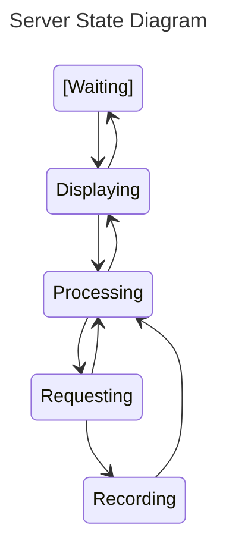
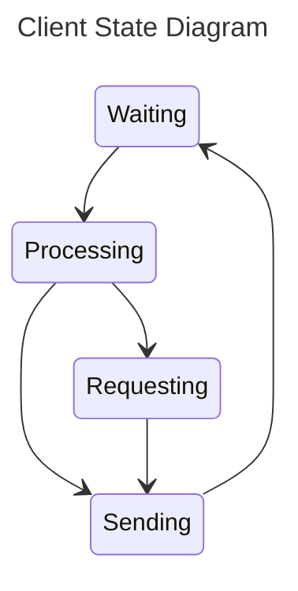

**Purpose**

The Design Document - Part I Architecture describes the software architecture and how the requirements are mapped into the design. This document will be a combination of diagrams and text that describes what the diagrams are showing.

**Sequence Diagrams**

**Use Case #5 Rainy Day**: A user that wants to be informed on what to wear throughout the day as they are rushing to get ready to leave the house for work.

Rainy Day Description

1. They step in front of the mirror as they do their daily morning routine in the bathroom.
2. The camera detects the user’s face with the camera and turns on the screen display behind the 2 way mirror.
3. The mirror's Rasberry Pi retrieves data from the Open Weather API.
3. The mirrors widget display shows a heavy rain forecast icon in the afternoon despite being currently clear as day.
4. The user remembers to grab their raincoat and umbrella and goes about their day avoiding the uncomfortableness of cold rain.

**Algorithms** 

**State Diagrams**

##### Server State Diagram
The diagram above shows the different states that Smart Mirror will operate in. First the mirror acts in the waiting state, while it idles and waits for a face to be recognized. Once a face is seen the program will start displaying and the user's default widgets will appear. When new data is to be requested, the state then moves to the processing stage where it will determine if the data is already captured in the database, if it is then it will move back to the displaying state. If the data is not in the database then the state will change to requesting, and then the required data will start to be requested. Once the new data is requested, it will be recorded in the database and then processed. Once the data is processed it will then be displayed. The mirror will move from the display state to the waiting state if a face is not recognized in a short period of time.

##### Client State Diagram
The diagram above shows the states for the client side companion application. Initially we begin in the waiting phase where we wait for user input. Once the user does an action in the application we move to the processing stage where we decide how to follow the user's commands. If we have the data already in our database we move to the sending to server state. Otherwise if we need to request data then we move to the requesting state. After requesting data, we then move to the recording state where we record the information in our database. Once the data is recorded we move to the sending state where we send the data the Rasberry Pi server. Then we move to the waiting state again for further instructions.

**Database**
Entity-relation diagram.
Table design.

A check list for architecture design is attached here [architecture\_design\_checklist.pdf](https://templeu.instructure.com/courses/106563/files/16928870/download?wrap=1 "architecture_design_checklist.pdf")  and should be used as a guidance.
